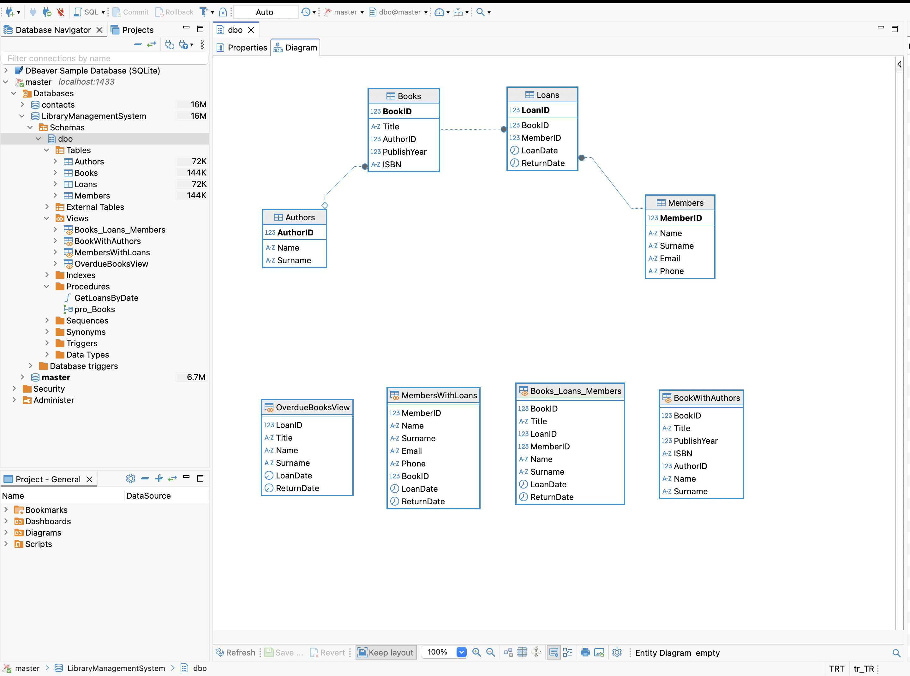
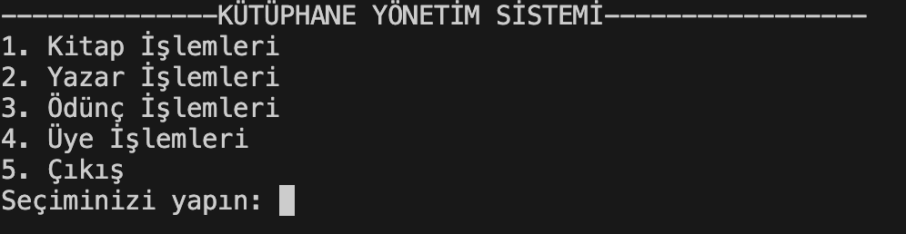
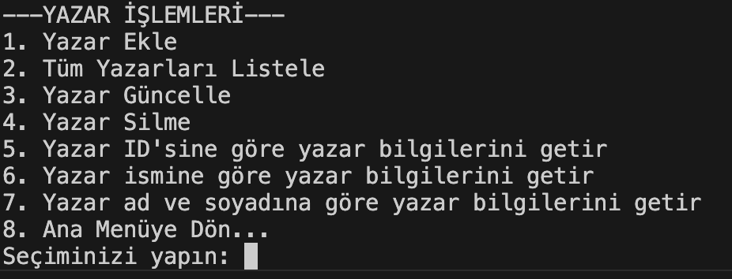
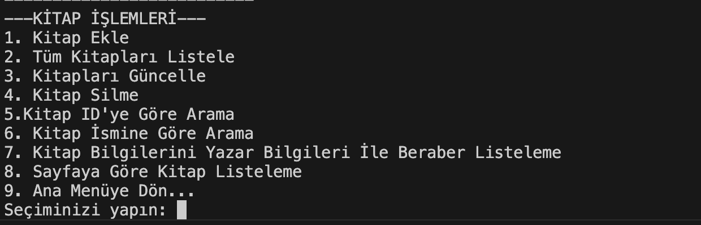
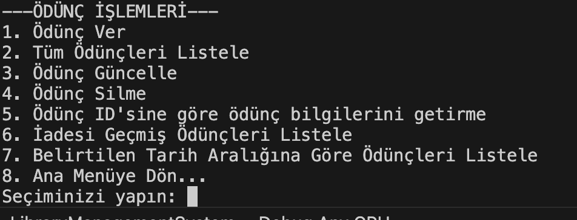
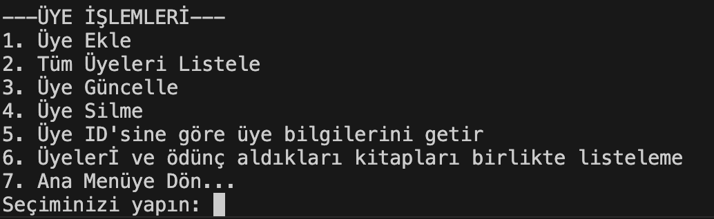

# 📚 Library Management System

Bu proje bir **Kütüphane Yönetim Sistemi**'dir. Temel ve ileri seviye veri tabanı sorgularını, C# ve ADO.NET ile birleştirerek oluşturulmuş bir konsol uygulamasıdır.Kitapları yönetmek, üyeleri takip etmek ve kiralama işlemleri yapmak için geliştirilmiştir.

---

## 🚀 Özellikler

- 📖 Kitap ekleme, silme ve güncelleme
- 👤 Üye kaydı ve bilgilerini görüntüleme
- 📅 Kitap kiralama ve iade işlemleri
- 🔍 Kitap arama fonksiyonu

---
## 📸 Ekran Görüntüleri

-Veri Tabanı Yapısı

-Giriş Ekranı

-Yazar İşlemleri

-Kitap İşlemleri

-Ödünç İşlemleri

-Üye İşlemleri

(

